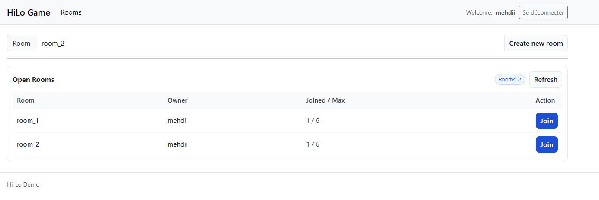
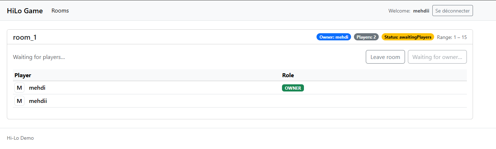
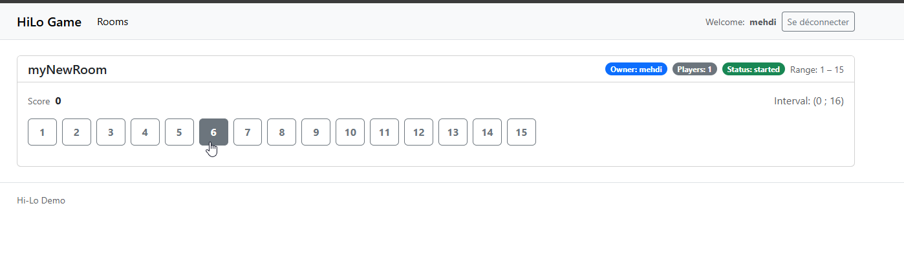
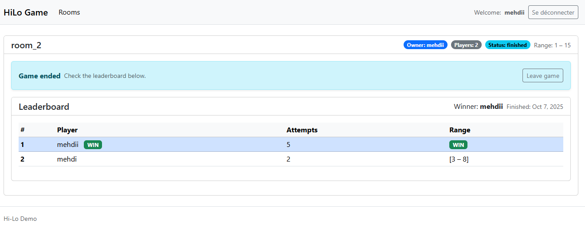
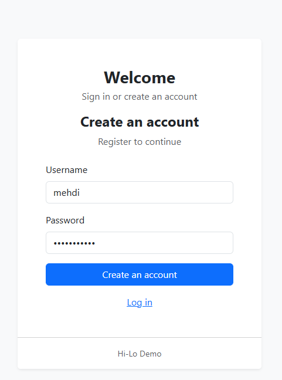

# 🎮 Hi-Lo Game – Multiplayer Edition

This project is a **multiplayer implementation of the Hi-Lo game**, developed as part of a **technical interview for Gaming1**.  
It demonstrates my ability to design, structure, and deliver a clean, maintainable backend-frontend system using **modern technologies and architectural best practices**.

The goal of the game is simple:  
Each player tries to **guess a secret number** between a configurable range (`[Min, Max]`).  
After each guess, the server responds whether the mystery number is **higher** or **lower** .  
In multiplayer mode, several players compete **in real time** — the first to find the secret number wins.





---

## 🔐 Authentication & Security

- The application includes a complete **user registration and login system** built on top of **ASP.NET Identity** with **JWT (JSON Web Token)** authentication.  
- The project uses AspNet.Identity.UserIdentity library and the UserManager manange JWT Tokens generation and validation. 
- Each player must sign up and log in before joining or creating a room.  
- The issued JWT token secures every API request, ensuring that only authenticated users can interact with the game (create rooms, make guesses, etc.).  
- This design keeps the multiplayer environment safe, isolates user actions, and enables straightforward integration with front-end authentication flows in Angular.

### Create account


---

## 🧱 Technical Overview

The project follows a **Clean Architecture + Domain-Driven Design (DDD-lite)** approach to ensure a clear separation of concerns, scalability, and testability:

- **Domain Layer** – Pure C# business logic and invariants (e.g., `Room`, `RoomPlayer`, `GameRules`, `Player`).
- **Application Layer** – Use cases and orchestrations, independent of frameworks.
- **Infrastructure Layer** – Data persistence using **Entity Framework Core + SQL Server**.
- **API Layer** – ASP.NET Core Web API exposing endpoints for room and player management.
- **Frontend Layer** – **Angular** client that connects through **SignalR** for real-time updates (join/leave, start game, guess results).

The multiplayer experience relies on **SignalR** to broadcast room updates and guesses instantly to all connected players.

---

## ⚙️ Highlights

- ✅ **Clean architecture** ensuring domain purity and maintainability
- ⚡ **Real-time gameplay** using SignalR
- 🧩 **DDD-style entities and value objects** encapsulating game logic
- 💾 **SQL Server persistence** with EF Core migrations
- 🌐 **Angular client** providing a simple UI to create and join rooms, make guesses, and view results live

---
## ⚙️ Environments

Environnement de dev complet en **une commande** grâce à Docker Compose :
- **API** : ASP.NET Core + SignalR
- **Client** : Angular 20 (serve with Nginx)
- **DB** : SQL Server 2022 (persistant volume)

---

## 🧱 Project structure

```
HiLoGame/
├─ hilogame-api/
│  ├─ HiLoGame.Api/                # Projet .NET (API)
│  ├─ HiLoGame.Application/            
│  ├─ HiLoGame.Domain/             
│  ├─ HiLoGame.Infrastructure/             
│  └─ HiLoGame.Shared/             
├─ hilogame-client/            # App Angular (Dockerfile + nginx.conf)
└─ docker-compose.yml
```

---

## ⚙️ Prerequisites

- Docker Desktop (or Docker Engine) + Compose v2
- Free ports: **8080** (client), **5047** (API), **14333** (SQL Server)

---

## 🚀 Quick Start

```bash
docker-compose up --build
# or detached
# docker-compose up --build -d
```

- Client : http://localhost:8080
- API : http://localhost:5047
- SignalR Hub : `http://localhost:5047/hubs/game`
- SQL Server (depuis l’hôte) : `localhost:14333` (Database=`hilo-db`;  login=`sa`; mot de passe = `Your_strong_password123!`)


## 🧪 Tester rapidement

```bash
docker-compose up --build tests
```


