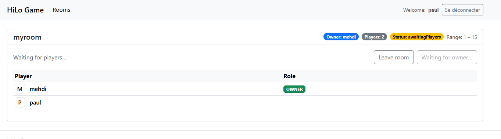

# 🎯 Game Rules Implemented

## The Room Concept

A **Room** represents one isolated multiplayer session of the Hi-Lo game.  
It acts as the aggregate root of the gameplay logic and encapsulates:

- The **game configuration** (`GameRules`: min/max range, allowed players, etc.)
- The **list of players** (`RoomPlayer` entities, each tracking its own progress)
- The **current status** (`ERoomStatus`: `AwaitingPlayers`, `Started`, `Finished`, or `Closed`)
- The **secret number** chosen by the owner
- And metadata such as the **owner**, **winner**, and **creation date**

A player (the **owner**) creates a room, which starts in the `AwaitingPlayers` state.  
Other players can join until the game starts. Once the owner trigger the `start` action, it launches the game by in realtime on all the connected player browsers.  
From that moment, all players try to guess the mystery number in real time.  
The system (frontend) gives visual feedback of the remaining range, helping each player narrow their personal search interval.  
When a player finds the correct number, the game ends instantly (realtime for all users), and the results are broadcast to everyone through SignalR.

---

## Room Lifecycle (Finite State Machine)
- **Statuses:** `AwaitingPlayers` → `Started` → `Finished` (someone has found the secret) or `Closed` (unfinished games).
- A room is created in **`AwaitingPlayers`** with an owner and default rules (`GameRules.CreateDefault()`).
- 
- Any players can join the room. The information of a player joining a room is broadcast in realtime.  
- 
- 
- 
- The game transitions to **`Started`**: All players have an array of numbers appearing in their browser. 
They have to make a guess by clicking on a number.  
- 
- 
- 
- The game transitions to **`Finished`** when a player guesses the secret.
All the player are stopped and a leaderboard appears (in realtime).

- If a player left the game early: its detected and he will appears as `disconnected` on the leaderboard.
- 
- The room becomes **`Closed`** when:
    - the owner leaves before start, or
    - all players have left during a started game, or
    - a room awaiting players ends up with **zero** players.

---

## Joining & Ownership
- The **owner** is automatically added on room creation; `OwnerId` and `OwnerUsername` are mandatory.
- Players can **join only** while the room is `AwaitingPlayers`.
- `AddPlayer` is **idempotent**: re-adding the same player does nothing.
- Player capacity is enforced by rules via `Rules.EnsurePlayersAllowed(_players.Count + 1)`.

---

## Starting a Game
- `Start(secret)` is allowed only when:
    - status is `AwaitingPlayers`,
    - there is **at least one** player,
    - and the caller is the **owner** of the room.
- The `secret` must be **within range**: `Rules.EnsureGuessInRange(secret)`.
- On start, each `RoomPlayer` is initialized:
    - `Status = Playing`
    - Boundaries:  
      `SecretIsGreaterThan = Rules.Min - 1`  
      `SecretIsLessThan  = Rules.Max + 1`
    - Attempts and timestamps are reset (`Attempts = 0`, `FirstGuessAt = null`, `LastGuessAt = null`).
- `Room.Secret` is stored and `Status = Started`.

---

## Guessing Logic
- `MakeGuess(playerId, guess)` is allowed only if:
    - room status is `Started`,
    - the player **belongs** to the room,
    - the player’s status is `Playing`,
    - and the guess is **within range** (`Rules.EnsureGuessInRange`).
- Timestamps and counters:
    - `FirstGuessAt` is set **on the first guess only**.
    - `LastGuessAt` is updated **every** guess.
    - `Attempts` increments **every** guess (the winning attempt **counts**).
- Feedback and narrowing:
    - If `guess < Secret`: **TooLow** → `SecretIsGreaterThan = max(current, guess)`
    - If `guess > Secret`: **TooBig** → `SecretIsLessThan = min(current, guess)`
    - Returned object: `GuessOutcome` includes the **result** (`TooLow` / `TooBig` / `Win`), timestamps, attempt count, and the **current narrowed interval** (`[SecretIsGreaterThan + 1 ; SecretIsLessThan - 1]`).

---

## Victory & End of Game
- If `guess == Secret`:
    - Room becomes `Finished`.
    - `WinnerPlayerId = playerId`.
    - All players still `Playing` are marked `Finished`.
    - The winning `GuessOutcome` returns `Win` with full context (attempts, timing, bounds).

---

## Leaving & Closing Rules
- `RemovePlayer(playerId)` is **idempotent** (no effect if unknown).
- If room is `Finished` or `Closed`: **no change** (records are kept).
- If `AwaitingPlayers`:
    - If the **owner leaves**: room becomes **Closed** (cannot start without owner).
    - Otherwise: remove the player; if **no one remains**, room is **Closed**.
- If `Started`:
    - The leaver is marked `Left` (appears in leaderboard/history).
    - If **all** players leave mid-game, room becomes **Closed**.

---

## Validation & Safety
- Domain invariants are enforced via exceptions (e.g., `DomainException` on invalid transitions or input).
- Range checks and player capacity are **centralized** in `GameRules`:
    - `Min/Max` bounds for guesses and the secret number.
    - Maximum player limit (if defined), via `EnsurePlayersAllowed`.
    - `EnsureGuessInRange` for all guess and secret validations.

---

## Data Captured for UI 
- **Per player:** `Attempts`, `FirstGuessAt`, `LastGuessAt`, personal narrowed interval (`SecretIsGreaterThan` / `SecretIsLessThan`), `Status` (`Waiting`, `Playing`, `Finished`, `Left`), `JoinedAt`.
- **Per room:** `Status`, `WinnerPlayerId`, `CreatedAt`, `OwnerId` / `OwnerUsername`, and `Rules` (range & constraints).
- This data enables **leaderboards**, **timing analytics**, and **real-time progress visualization** for each player — showing how their search space evolves after every guess.
